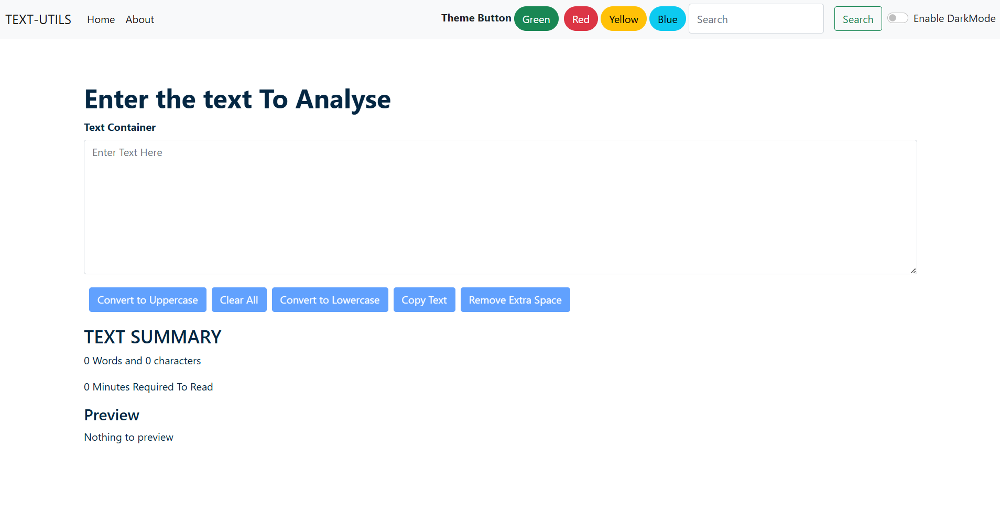
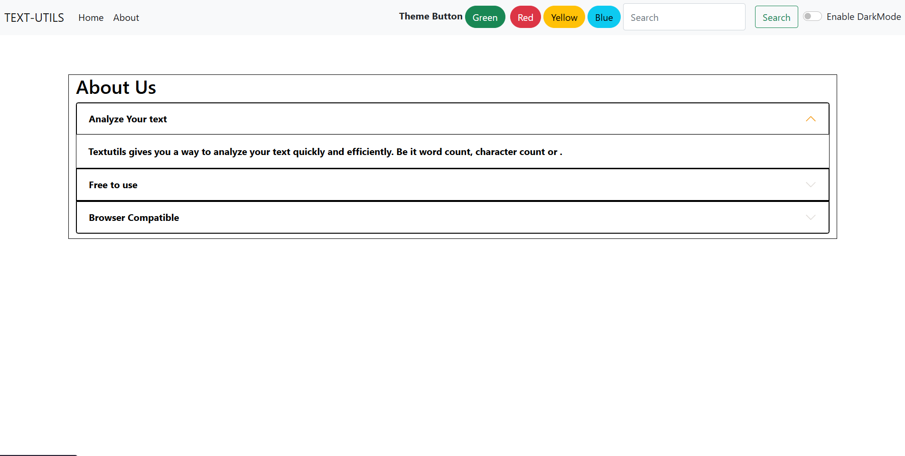

# TextUtils

TextUtils is a React-based web application that provides a collection of useful text manipulation and analysis tools. It helps users quickly format, transform, and analyze text through a simple and responsive user interface.

## Features

* Convert text to Uppercase
* Convert text to Lowercase
* Remove extra spaces
* Copy text to clipboard
* Clear text instantly
* Word count and character count
* Reading time estimation
* Live text preview
* Responsive design

## Tech Stack

* React.js
* JavaScript (ES6+)
* HTML5
* CSS3
* Bootstrap

## Installation

1. Clone the repository:

```bash
git clone https://github.com/your-username/TextUtils.git
```

2. Navigate to the project directory:

```bash
cd TextUtils
```

3. Install dependencies:

```bash
npm install
```

4. Start the development server:

```bash
npm start
```

The application will be available at `http://localhost:3000`.

## Usage

1. Enter or paste text into the input area.
2. Select the desired text utility operation.
3. View the transformed text and analysis results instantly.

## Project Structure

```text
src/
├── components/
├── App.js
├── index.js
└── ...
```

## Screenshots

## Screenshots

### Home Page


### About Page



